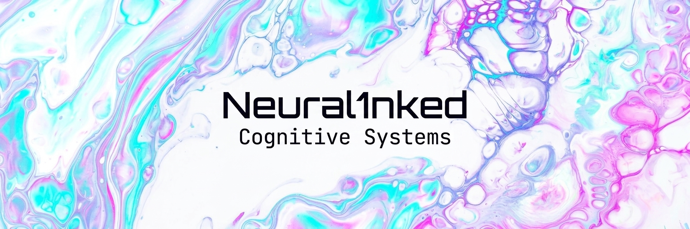

 

 

<h2>

 RESEARCH PROFILE
</h2>

Artificial Intelligence is not my final destination—it is one of the paths toward understanding how intelligence emerges, learns, remembers, reasons and adapts.

I'm currently building a solid foundation in **Computer Science**, **Artificial Intelligence**, **Machine Learning**, **Neuroscience** and **Cognitive Science**, with the long-term goal of contributing to technologies that bring biological and artificial intelligence closer together.

Rather than simply developing models, I'm interested in understanding the principles behind **learning**, **memory**, **reasoning** and **cognition**.

I believe the future will not be defined by machines replacing humans, but by humans and intelligent systems evolving together.

 

<h2>

 CURRENT PROFILE
</h2>

### Artificial Intelligence

Building a solid understanding of intelligent systems, learning algorithms and modern AI architectures.

### Cognitive Systems

Exploring memory architectures, reasoning, knowledge representation and cognitive-inspired AI.

### Neuroscience

Studying biological cognition and neural mechanisms to better understand intelligence.

### Backend Engineering

Designing scalable infrastructures capable of supporting future intelligent systems.

 

<h2>

 RESEARCH INFRASTRUCTURE
</h2>

The technologies below represent the ecosystem I'm currently studying to build future intelligent systems.

 

### Languages & Backend

### Artificial Intelligence

 

 

<h2>

 RESEARCH ACTIVITY
</h2>

 

<h2>

 CURRENT INTERESTS
</h2>

 

<h2>FINAL NOTE</h2>

Intelligence is not something to be replicated.

It is something to be understood.

 

The future of Artificial Intelligence will not be defined only by larger models or faster hardware, but by our ability to understand how cognition emerges from interaction, memory, perception and adaptation.

That is the direction I want to explore.

 

<blockquote>
There are no intelligent machines. 
Only machines we haven't understood yet.
</blockquote>

 

